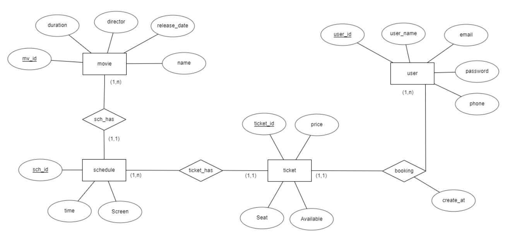

# Website H2M BookingTicket
Mô tả: Đây là trang web giúp người dùng có thể đặt vé xem phim online

Công nghệ sử dụng:
- Client: ReactJs
- Server: NodeJs
- Database: MySQL (Clever-cloud)

Các tác vụ:
- Đăng kí/Đăng nhập

- Xem các phim hiện hành & quảng cáo

- Đặt vé xem phim

- Xem thông tin người dùng, xem lịch sử mua vé    

## Mô hình ERR 

    Có 4 thực thể quan hệ
## Mô hình Database 
Từ mô hình ER, hình thành nên mô hình Database gồm 5 bảng

